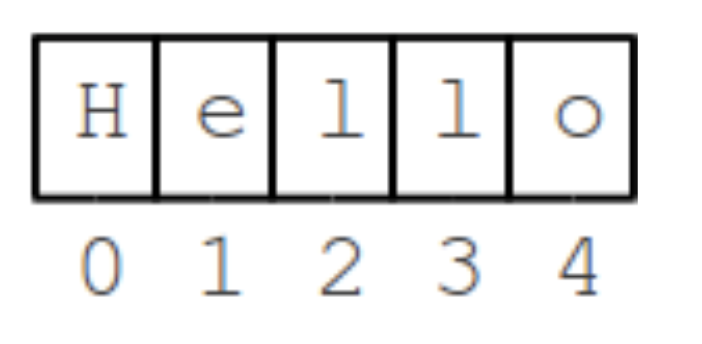
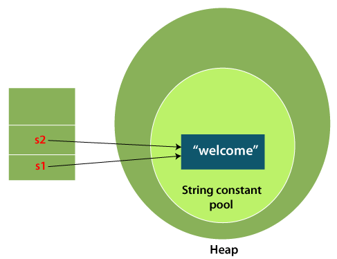
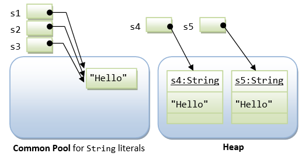
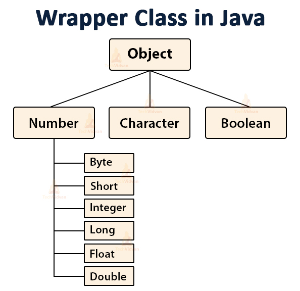
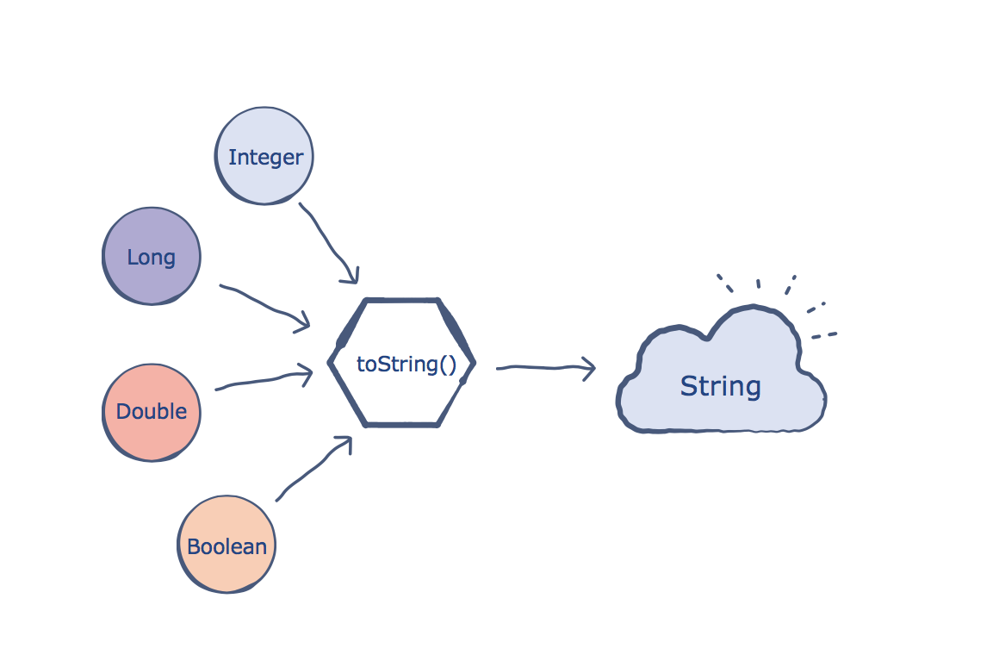
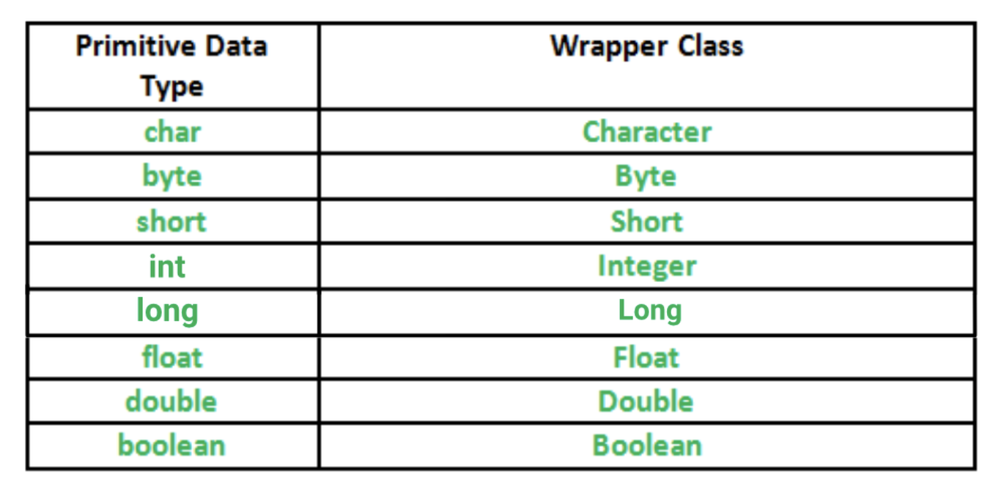

# String overview

## Materials
- String type overview
- Basic methods
- Why String is Really Special?

### String Type Overview
_String_ is a class, which represents character strings. All string literals in Java programs, such as "java" or "practice makes perfect", are implemented as instances of this class.
Strings are constant. That is, it's content cannot be modified once it is created.
There are 2 ways of creating a String instance in Java: 

 1. Using **new**:

        String favColour = new String("Green");

    The String class supports several constructors, for example: String(), String(String str), String(byte[] asciichar), String(char[] unicodechar),
 etc.
 
        char chars[]={'s','t','r','i','n','g','s'};    
        String strFromChar = new String(chars);//converting char array to string    
        System.out.println(strFromChar);
     Result:
     
        strings
 2. Using literal (enclosed in double quotes):

        String bestMovie = "Harry Potter";

To summarize:

- String stores text -- a word, an email, a book;
- All computer languages have strings, look similar;
- "In double quotes";
- Sequence of characters ("char").

### String Class Basic Methods
 1. Return the length of the String
 
         int length();
         
    The "length" of a string is just the number of chars in it. So "java" is length of 4 and "Hello" is length 5.
    
         String progrLanguage = "Scala";
         int len = progrLanguage.length();
    Output:
          
          5
 2. String Index Numbers:
    - Index numbers -- 0, 1, 2, ...
    - Leftmost char is at index 0
    - Last char is at index length-1
    
    
    
    (Index from 0 to str.length()-1)
    The chars in a string are identified by "index" numbers. In "Hello" the leftmost char (H) is at index 0, the next char (e) is at index 1, and so on.
    
     2.1. int indexOf(char ch );
     
       This method returns the index within this string of the first occurrence of the specified character or -1, if the character does not occur:
     
        String mjc = new String("Welcome to MJC!");
         
        System.out.print("Found 't' first at position : ");
         
        // Initial index of 't' will print
        // prints 8
        System.out.println(mjc.indexOf('t')); 
        
     2.2.  int indexOf(char ch, int strt);
        
       This method returns the index within this string of the first occurrence of the specified character, starting the search at the specified index or -1, if the character does not occur.
        
        String mjc = new String("Welcome to MJC school!");
                
        System.out.print("Found 'o' after 7 index at position : ");
                
        // prints 9
        System.out.println(mjc.indexOf('o', 7));   
        
  3. String Substring
  
     - str.substring(start)
     - Chars beginning at index start
     - Through the end of the string
   
      The substring() method picks out a part of string using index numbers to identify the desired part. The simplest form, substring(int start) takes a start index number and returns a new string made of the chars starting at that index and running through the end of the string
   
         String a = str.substring(1);  // a is "arry Potter" (i.e. starting at index 1)
         String b = str.substring(2);  // b is "rry Potter"
         String c = str.substring(3);  // c is "ry Potter"
       The start (begin index) parameter must be within the range of source string, otherwise you would see the following exception:
    
         java.lang.StringIndexOutOfBoundsException: String index out of range:
   
 

**In all cases of calling methods that modify a string, a new object of type String is created!**
###Why String is Really Special?
 1. String + Concatenation.
 
    The + (plus) operator between strings puts them together to make a new, bigger string. The bigger string is just the chars of the first string put together with the chars of the second string.
      
        String bestSeason = "Sum" + "mer";
    Keep in mind that Strings not made of the letters a-z. For example chars can be punctuation:
     
        String currentDate = "The 31st" + " " + "of January" + ", ";
 2. String is immutable. 
    Since string literals with the same contents share storage in the common pool, Java's String is designed to be immutable. That is, once a String is constructed, its contents cannot be modified. Otherwise, the other String references sharing the same storage location will be affected by the change, which can be unpredictable and therefore is undesirable.
    
    What does it mean in practise?
    Let's consider the following example:
      
        String myStr = "CONVERT ME TO LOWER CASE";
        myStr.toLowerCase();
        System.out.println(myStr);
    
    Result:
        
        CONVERT ME TO LOWER CASE 
    
    That's what we expected since we did not declare new String variable, whose result would be usage of toLowerCase().
    Let's fix it:
    
         String myStr = "CONVERT ME TO LOWER CASE";
         String myStrInLowerCase = myStr.toLowerCase();
         System.out.println(myStrInLowerCase);
         
    Result:
    
         convert me to lower case
         
    You should always remember it while using String.
    
    Also take a look at 
    ```
        String str = "Java";
        for (int i = 0; i < 1000; ++i) {
           str = str + i;
        }
     ```
    New String str is created every time! For 1000 times! It's inefficient String usage. This topic will be covered further, and you will understand how to overcome it. 
 3. As mentioned, there are two ways to construct a string: 
     1) implicit construction by assigning a string literal 

      or 
      
     2) explicitly creating a String object via the new operator and constructor. 
   
   Basic explanation:
   1) Java has provided a special mechanism for keeping the String literals - in a so-called string common pool. If two string literals have the same contents, they will share the same storage inside the common pool. This approach is adopted to conserve storage for frequently-used strings. 
   
   String s1="Welcome";  
   String s2="Welcome";//It doesn't create a new instance  
   
   
   2) On the other hand, String objects created via the new operator and constructor are kept in the heap. Each String object in the heap has its own storage just like any other object. There is no sharing of storage in heap even if two String objects have the same contents.
    
    
   Let's see the actual difference on the following examples:
   ```
       s1 == s1;        // true, same pointer
       s1 == s2;        // true, s1 and s1 share storage in common pool
       s1 == s3;        // true, s3 is assigned same pointer as s1
       s1.equals(s3);   // true, same contents
       s1 == s4;        // false, different pointers
       s1.equals(s4);   // true, same contents
       s4 == s5;        // false, different pointers in heap
       s4.equals(s5);   // true, same contents
   ```
   To summarize:
   1. Operator "==" is used to compare references;
   2. To compare actual value you can use _equals_() method.
   
##Extra Materials
 1. https://docs.oracle.com/javase/7/docs/api/java/lang/String.html#substring(int)
 2. https://www3.ntu.edu.sg/home/ehchua/programming/java/J3d_String.html
 
 
#Object Overview

## Materials
- Object type overview
- Object basic methods

### Object Type Overview
Object class is present in java.lang package.The Object class is the parent class of **all** the classes in java by default (yes, and String Type either). In other words, it is the topmost class of java. 
It was introduced in JDK1.0.


### Object Class Basic Methods
 1. toString();
    This method returns the string representation of this object. Keep in mind that it "textually represents" this object. The default behavior is to print class name, then @,
     then unsigned hexadecimal representation of the hash code of the object. In the future, you will override this behavior according to your goals.
    ```
    //Creating an integer of value 10
    Integer number=10;
    // Calling the toString() method of the Integer variable
    String numberRepres = number.toString();
    System.out.println(numberRepres);
    ```
   Result:
   ```
   10
  ```
  Where 10 is a String! So it looks like 
  ```
  String numberRepres = "10";
```
  What actually happens:
  
  
  Integer, Long, Double and Boolean are Wrapper Classes - are classes whose object wraps or contains primitive data types. When we create an object to a wrapper class, it contains a field and in this field, we can store primitive data types. In other words, we can wrap a primitive value into a wrapper class object.
  
    
 2. equals(Object obj);
    We used this method in String Overview. It compares the given object to this object:
    ```
    String s1 = "First";
    String s2 = "Second";
    System.out.println(s1.equals(s2));//It compares s1 ('this') value with s2 ('the given object')
    ```
    Result as expected:
    ```
    false
    ```
 3. getClass();
 Is used to get the actual runtime class of the object. It can also be used to get metadata of this class (for example name)
 
    Explanation:
    ```
    String obj = new String("MJC-School");
    System.out.println(obj.getClass().getName());
    ```
    Result:
    ```
    java.lang.String
    ```
 All these and others methods will be covered further.
 
 ##Extra Materials
  1. https://docs.oracle.com/javase/7/docs/api/java/lang/Object.html#Object()
  2. https://www.geeksforgeeks.org/wrapper-classes-java/
  
  